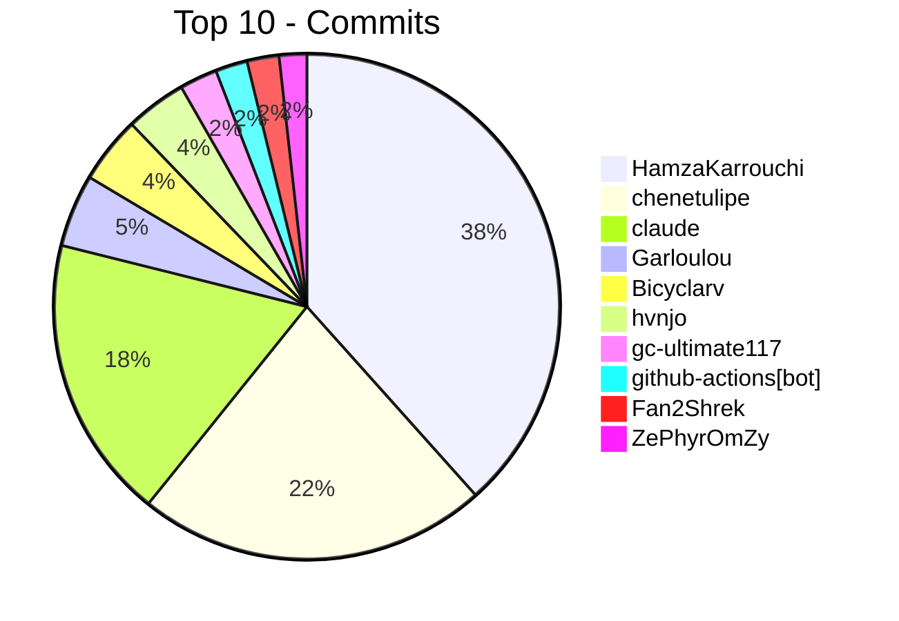
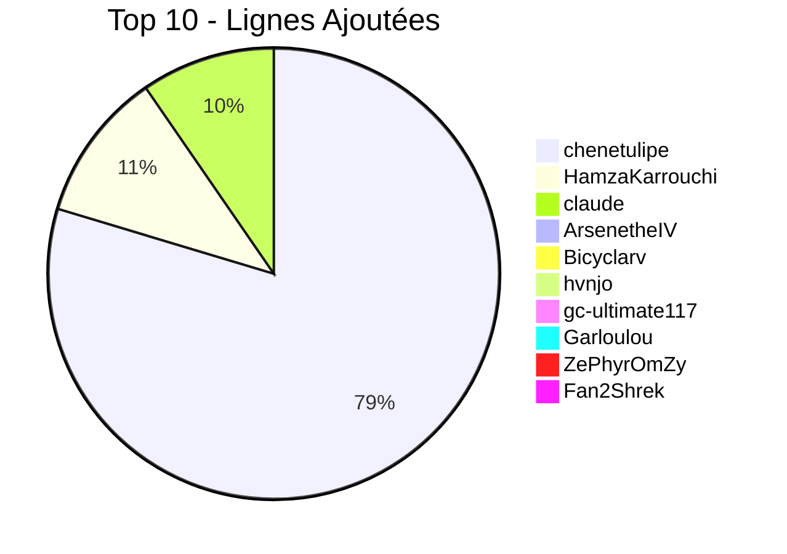
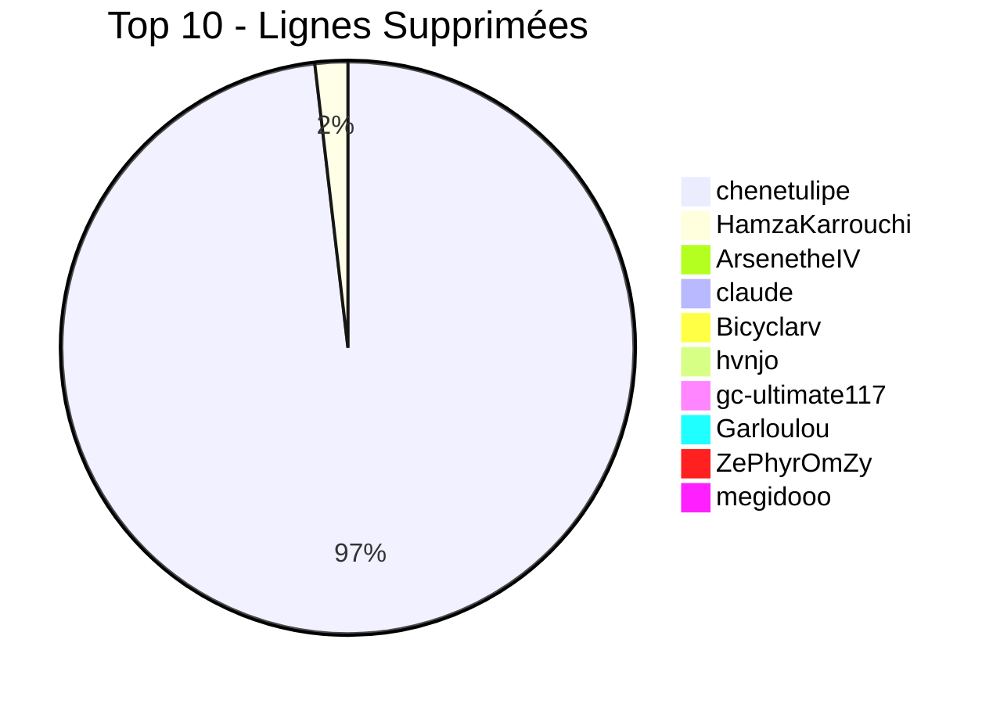

  
# Crédits & Remerciements
  
**Persona 2: Innocent Sin FR (PSP)**

   
  
  
  
   
   

> [!NOTE]
> Ce projet de traduction n'aurait jamais pu voir le jour sans le travail acharné, la passion et le dévouement de tous nos contributeurs. Cette page vous est dédiée !

---

## L'Équipe Principale

Voici les piliers du projet et leur rôle respectif au sein de l'équipe de traduction :

| Contributeur | Rôle principal |
|:---|:---|
| **@chenetulipe** | **Fondateur.** Responsable du romhacking, du développement technique et de la traduction. |
| **@Garloulou** | **Co-traducteur.** Soutien majeur sur la localisation des dialogues et des termes du jeu. |
| **@Haaamza** | **Responsable Relecture.** Créateur de la plateforme web de correction et traducteur. |

---

## Remerciements Spéciaux

Le projet inclut des éléments visuels HD qui n'auraient pas été possibles sans le travail préalable de la communauté internationale :

* **@racawr** : Auteure du mod d'origine *"HD UI for Persona 2 - Innocent Sin"*. Ses formidables textures remasterisées ont servi de base à notre équipe pour la version française. Un immense merci pour l'autorisation d'utilisation !

---

## Classement des Contributeurs (Auto)

Grâce à un robot (GitHub Action) qui tourne toutes les nuits, ce classement et ces graphiques (commits, ajouts et suppressions de lignes) sont récupérés directement depuis les serveurs de GitHub et mis à jour tout seuls de manière autonome !

<!-- STATS_START -->

### Statistiques Globales du Code

| Contributeur | 💾 Commits | ➕ Lignes Ajoutées | ➖ Lignes Supprimées |
|:---|:---:|:---:|:---:|
| **[@HamzaKarrouchi](https://github.com/HamzaKarrouchi)** | 413 | +258448 | -35647 |
| **[@chenetulipe](https://github.com/chenetulipe)** | 241 | +1913279 | -1892806 |
| **[@claude](https://github.com/claude)** | 195 | +230575 | -8528 |
| **[@Garloulou](https://github.com/Garloulou)** | 50 | +769 | -517 |
| **[@Bicyclarv](https://github.com/Bicyclarv)** | 46 | +3311 | -3311 |
| **[@hvnjo](https://github.com/hvnjo)** | 42 | +2675 | -2676 |
| **[@gc-ultimate117](https://github.com/gc-ultimate117)** | 26 | +1503 | -1503 |
| **[@github-actions[bot]](https://github.com/github-actions[bot])** | 22 | +329 | -332 |
| **[@Fan2Shrek](https://github.com/Fan2Shrek)** | 22 | +395 | -356 |
| **[@ZePhyrOmZy](https://github.com/ZePhyrOmZy)** | 19 | +403 | -403 |
| **[@megidooo](https://github.com/megidooo)** | 18 | +386 | -386 |
| **[@Gyotre](https://github.com/Gyotre)** | 16 | +355 | -352 |
| **[@LeSoupeur](https://github.com/LeSoupeur)** | 15 | +163 | -163 |
| **[@ArsenetheIV](https://github.com/ArsenetheIV)** | 14 | +10059 | -11358 |
| **[@Tausc0](https://github.com/Tausc0)** | 12 | +62 | -62 |
| **[@Seb180212](https://github.com/Seb180212)** | 9 | +155 | -152 |
| **[@FrankoPaulo](https://github.com/FrankoPaulo)** | 9 | +117 | -117 |
| **[@vkt2rii](https://github.com/vkt2rii)** | 9 | +308 | -309 |
| **[@IssaPagi](https://github.com/IssaPagi)** | 9 | +85 | -85 |
| **[@Ethan-LDS](https://github.com/Ethan-LDS)** | 7 | +169 | -169 |
| **[@All4nRL](https://github.com/All4nRL)** | 6 | +61 | -61 |
| **[@chaytheninja](https://github.com/chaytheninja)** | 5 | +100 | -99 |
| **[@Kain-Highwind](https://github.com/Kain-Highwind)** | 4 | +281 | -281 |
| **[@MBG-May](https://github.com/MBG-May)** | 4 | +185 | -184 |
| **[@aurelien30](https://github.com/aurelien30)** | 4 | +132 | -132 |
| **[@driftbyte4767](https://github.com/driftbyte4767)** | 3 | +284 | -284 |
| **[@Shrenpai](https://github.com/Shrenpai)** | 3 | +123 | -123 |
| **[@ZeldarioGitHub](https://github.com/ZeldarioGitHub)** | 3 | +53 | -53 |
| **[@Aniy22](https://github.com/Aniy22)** | 2 | +25 | -25 |
| **[@LykeSama](https://github.com/LykeSama)** | 2 | +33 | -33 |
| **[@Neth6767](https://github.com/Neth6767)** | 2 | +85 | -85 |
| **[@Diamondssb](https://github.com/Diamondssb)** | 2 | +45 | -45 |
| **[@Sammmu-L](https://github.com/Sammmu-L)** | 2 | +22 | -22 |
| **[@Astakoune](https://github.com/Astakoune)** | 2 | +65 | -65 |
| **[@Door-dono](https://github.com/Door-dono)** | 2 | +39 | -39 |
| **[@nekorighthere](https://github.com/nekorighthere)** | 2 | +86 | -86 |
| **[@chenetulipe2](https://github.com/chenetulipe2)** | 2 | +6 | -6 |
| **[@Xeriam](https://github.com/Xeriam)** | 2 | +56 | -56 |
| **[@MaelMinhAnh](https://github.com/MaelMinhAnh)** | 1 | +77 | -77 |
| **[@Aurinox6](https://github.com/Aurinox6)** | 1 | +59 | -59 |
| **[@renaclerican](https://github.com/renaclerican)** | 1 | +29 | -29 |
| **[@Goulyz](https://github.com/Goulyz)** | 1 | +27 | -27 |
| **[@Lomac29](https://github.com/Lomac29)** | 1 | +20 | -20 |
| **[@Desseday](https://github.com/Desseday)** | 1 | +123 | -123 |
| **[@Adwara](https://github.com/Adwara)** | 1 | +130 | -130 |
| **[@mae7interludes](https://github.com/mae7interludes)** | 1 | +109 | -109 |

### Répartition des Contributions (Top 10)

#### Volume de Commits

#### Lignes Ajoutées

#### Lignes Supprimées

<!-- STATS_END -->

---

## Bêta-Testeurs & Traqueurs de Bugs (BÊTA de Juillet 2026)

*Cette section se remplira au fur et à mesure grâce aux retours des joueurs sur la BÊTA !*

Un immense merci à tous les joueurs de l'ombre qui parcourent le jeu de fond en comble pour nous remonter la moindre faute de frappe, erreur de césure, ou plantage technique. Votre œil de lynx permet de peaufiner la version finale !

| Pseudo (Discord / GitHub) | Zone d'expertise (Quêtes, Typo, Technique...) |
|:---|:---|
| *(Votre nom ici très bientôt !)* | - |
| | |
| | |

<!-- updated -->
