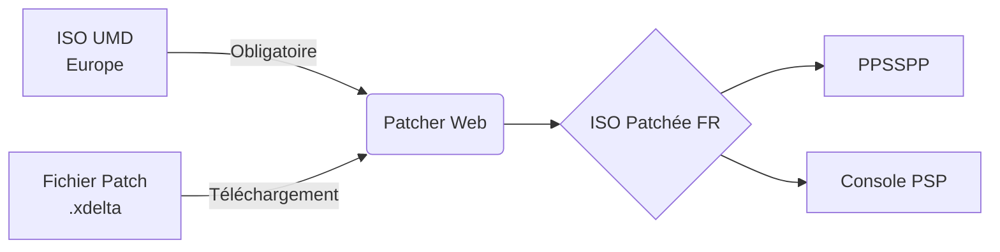

  
# Persona 2: Innocent Sin FR
  
**Le patch de traduction française intégral (PSP - ULES01557)**

 

 

 

  
<i>Cliquez sur l'image pour visionner un aperçu du jeu en français.</i>

 

> [!WARNING]
> **Clause de Tolérance Zéro** 
> Ce projet ne distribue **aucun fichier original du jeu ni ROM piratée**. Vous devez extraire légalement votre propre image disque (ISO) depuis votre UMD original. Ce patch est conçu **exclusivement** pour la version Europe (ULES01557). L'équipe ne peut être tenue responsable d'éventuels dommages liés à son utilisation.

 

---

## 🌟 Pourquoi jouer à cette version ?

- 📖 **100% Français (Accents Natifs) :** La trame scénaristique, le nom des démons, et l'interface ont été intégralement traduits. Finis les caractères manquants, la police a été reprogrammée pour afficher parfaitement les lettres accentuées françaises.
- 🎨 **Compatible HD UI :** Profitez de notre support officiel du fabuleux pack de textures HD pour émulateur, avec nos propres éléments UI remasterisés en français !
- ⚡ **Zéro Installation :** Vous ne voulez pas télécharger de logiciel complexe ? Utilisez notre *Patcher Web* directement dans votre navigateur.

 

---

## 🎮 Joueurs : Guide d'Installation Rapide

Le projet est actuellement en phase de **BÊTA publique**. L'histoire principale est intégralement jouable en français.

<b>► ÉTAPE PAR ÉTAPE : Comment appliquer le patch ?</b>

 

1. **Obtenez le patch** : Téléchargez le dernier patch BÊTA au format `.xdelta` depuis la section **[Releases](https://github.com/chenetulipe/P2-FR-IS-PSP/releases)**.
2. **Préparez votre jeu** : Munissez-vous de l'ISO européenne officielle (`ULES01557`) issue de votre UMD.
3. **Appliquez la traduction** : Allez sur notre **[Patcher Web P2IS FR](./p2is_patcher)** (simple, rapide, aucune installation requise).
4. **Jouez !** : Lancez l'ISO fraîchement générée sur l'émulateur **PPSSPP** (PC, Android, Mac) ou sur votre console PSP équipée d'un Custom Firmware.

<b>► OPTIONNEL : Installer le Pack de Textures HD</b>

 

1. Téléchargez le pack HD original sur GameBanana : [HD UI for Persona 2](https://gamebanana.com/mods/308752).
2. Installez-le dans le dossier de textures de votre émulateur PPSSPP.
3. Appliquez notre **patch de textures FR** (fourni dans nos Releases) par-dessus les fichiers du pack HD original pour remplacer les menus anglais par notre version française remasterisée !
*Un immense merci à [@racawr](https://gamebanana.com/members/1865032) pour ce travail titanesque.*

 

---

## 🛠️ Romhackers : Outils et Documentation

Ce dépôt n'héberge pas qu'un simple patch. Il centralise l'intégralité du code source de nos outils développés sur-mesure pour outrepasser les limitations du moteur d'Atlus. 

* ⚙️ **`p2is_tool/` (Backend de Romhacking)** : Une application locale (FastAPI/React/Python) ultra-performante. Elle décompose l'ISO, injecte des espaces mémoires de padding, intercepte les opcodes de Ghostlight, recalcule dynamiquement les pointeurs de la TOC du `CPK`, et ré-assemble l'ISO sans saturer la RAM.
* 🌐 **`p2is_patcher/` (Moteur WASM)** : Un Patcher Web (HTML/JS) autonome embarquant `DeltaPatcher` compilé en WebAssembly. Il utilise l'API Streams et un *Service Worker* pour patcher des fichiers de plus d'1 Go sans crasher le navigateur.

### Documentation Technique Complète
Pour assurer la transmission du savoir-faire à la communauté, nous avons documenté chaque aspect du projet :
* 📘 **[DEVELOPER.md](./DEVELOPER.md)** : La Bible technique (reverse-engineering, formats `.BNP` / `.GIM`, et opcodes).
* 📗 **[CONTRIBUTING.md](./CONTRIBUTING.md)** : Le guide à destination des traducteurs (limites de mémoire, relecture).
* 📙 **[Dictionnaire.md](./Dictionnaire.md)** : Le glossaire officiel pour garantir la cohérence absolue de l'univers.
* 📊 **[SUIVI.md](./SUIVI.md)** : Le tableau de bord et la progression détaillée du projet.
* 🏆 **[CREDITS.md](./CREDITS.md)** : L'équipe de traduction et nos dépendances Open-Source (CriFsLib, pycdlib, pspdecrypt).

 

---

## ❓ Foire Aux Questions (FAQ)

<b>Y aura-t-il un tutoriel vidéo pour installer le patch ?</b>

Oui. Une vidéo explicative détaillée sortira sur la chaîne YouTube de <a href="https://www.youtube.com/@chenetulipe">chenetulipe</a> prochainement. En attendant, n'hésitez pas à demander de l'aide sur notre serveur Discord.

<b>Comment puis-je aider à la relecture du jeu ?</b>

La phase de relecture est ouverte ! Un outil dédié a été développé par <a href="https://github.com/HamzaKarrouchi">Hamza</a> : <a href="https://hamzakarrouchi.github.io/p2is-relecture/">Site de relecture en ligne</a>.  
Vous pouvez y comparer le texte original avec la traduction et utiliser le Dictionnaire pour assurer la cohérence. Postez ensuite vos corrections dans le salon Discord <code>#scripts</code>.

<b>Le jeu plante sur ma PSP physique, pourquoi ?</b>

Le jeu modifie très lourdement les instructions de la RAM et de la VRAM, tout en imposant une compression CRILAYLA stricte. Si vous rencontrez un crash sur vrai hardware, signalez-le nous en ouvrant une Issue GitHub ou via Discord. Actuellement, l'émulateur PPSSPP est la plateforme la plus stable pour profiter du jeu.

 

---

## ⚖️ Avertissement Légal & Licence

> [!CAUTION]
> **Clause de Non-Responsabilité**
> 
> L'équipe de **P2‑FR‑IS‑PSP** décline formellement toute responsabilité en cas de dommages matériels ou logiciels, corruption de sauvegardes ou de l'ISO, et de dysfonctionnements rencontrés en jeu. 
> L'utilisation du patch et des outils se fait **à vos propres risques**. Nous recommandons vivement d'effectuer une copie de sécurité (Backup) de votre ISO originale et de vos Memory Sticks avant toute manipulation.

*Persona 2: Innocent Sin* est une marque déposée de © Atlus / SEGA. Ce projet est une traduction amateur à but non lucratif, réalisée par des passionnés. 

**Licence du Patch :** [CC BY-NC-SA 4.0](https://creativecommons.org/licenses/by-nc-sa/4.0/) 
Libre d'utilisation et de modification pour un usage personnel. **La vente ou la monétisation de ce patch, sous quelque forme que ce soit, est strictement interdite.**

 

  <a href="https://www.star-history.com/?repos=chenetulipe%2FP2-FR-IS-PSP&type=date&legend=top-left">
   <picture>
     <source media="(prefers-color-scheme: dark)" srcset="https://api.star-history.com/chart?repos=chenetulipe/P2-FR-IS-PSP&type=date&theme=dark&legend=top-left&sealed_token=LFm90kimgTV0pKr7wph4I01fXMDcl0pp1R6gKZQj-A7IbzSxbcuQ3Te4pkPherfmIEivpEoqHEUGj9nyRkBIcEEDu5ejv9MLjA1aY8v8ynFglkEs_gTGdQ" />
     <source media="(prefers-color-scheme: light)" srcset="https://api.star-history.com/chart?repos=chenetulipe/P2-FR-IS-PSP&type=date&legend=top-left&sealed_token=LFm90kimgTV0pKr7wph4I01fXMDcl0pp1R6gKZQj-A7IbzSxbcuQ3Te4pkPherfmIEivpEoqHEUGj9nyRkBIcEEDu5ejv9MLjA1aY8v8ynFglkEs_gTGdQ" />
     
   </picture>
  </a>

