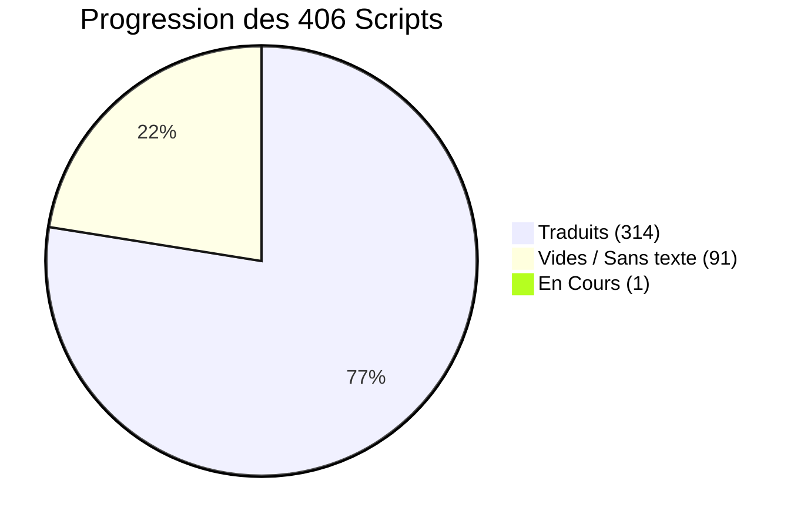
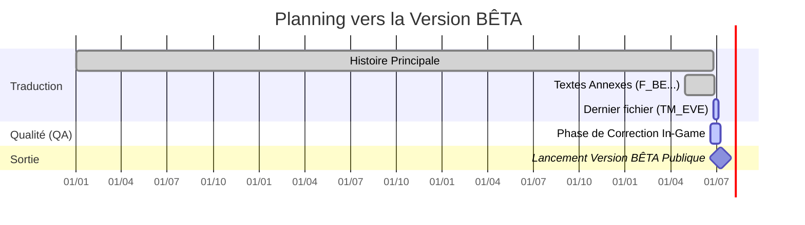

  
# Tableau de Bord & Suivi d'Avancement
  
**Persona 2: Innocent Sin FR (PSP)**

 

 

> [!NOTE]
> Cette page documente l'avancement global du projet de traduction. L'histoire principale est achevée, nous nous concentrons actuellement sur la phase d'Assurance Qualité (QA) et la relecture finale In-Game.

  <a href="https://docs.google.com/spreadsheets/d/1d0MADmYznfH-R43RLZAHrngTT5flK9UTVt4wTzc10Uw/edit?gid=0#gid=0"><b>📊 Suivi Détaillé sur Google Sheets</b></a> | <a href="./SUIVI_TECHNIQUE.md"><b>🛠️ Problèmes Connus & Bugs</b></a>

 

---

## Graphique d'Avancement Global

Voici la répartition des **406 fichiers scripts** gérant l'intégralité des textes du jeu :

> [!TIP]
> **Les Scripts Vides (91) :** Ils correspondent à des événements, des déclencheurs invisibles ou des chargements ne contenant aucun texte. Ils sont considérés comme terminés d'office.

 

---

## Détails de la Traduction

| Catégorie | Fichiers | Statut Actuel |
|:---|:---:|:---:|
| **Scripts d'Histoire** (`script_000` à `script_396`) | 397 |  |
| **Scripts de Carte** (`MMAP01` à `06`) | 5/6 |  |
| **Boutique de CDs** (`CD_SHOP`) | 1 |  |
| **Combats & Menus** (`F_BE`) | 1 |  |
| **Cinématiques narratives** (`TM_EVE`) | 1 |  |

> [!IMPORTANT]
> Le fichier `TM_EVE` est l'unique script nécessitant encore une intervention de traduction textuelle. La trame principale de l'histoire est achevée à 100 %.

 

---

## Phase de Relecture et Lancement

Le projet traverse actuellement la phase critique de vérification In-Game (Assurance Qualité).

<!-- updated -->
