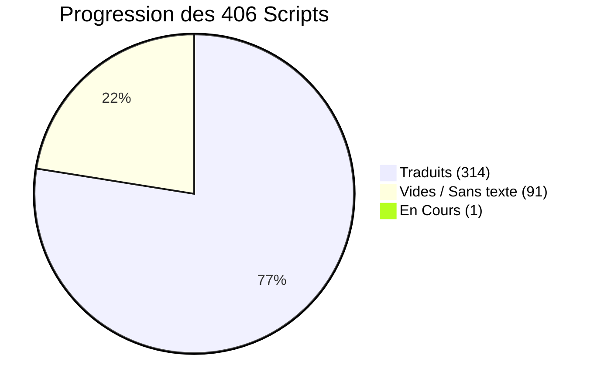
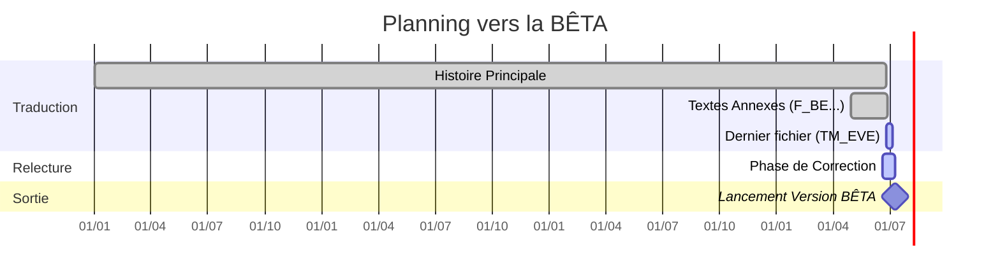

  
# Tableau de Bord & Suivi d'Avancement
  
**Persona 2: Innocent Sin FR (PSP)**

 

> [!NOTE]
> Cette page permet de suivre l'avancement du projet de traduction. 
> Les données ci-dessous sont synchronisées avec notre [Tableau de Suivi Google Sheets](https://docs.google.com/spreadsheets/d/1d0MADmYznfH-R43RLZAHrngTT5flK9UTVt4wTzc10Uw/edit?usp=sharing).

---

## Graphique d'Avancement Global

Voici la répartition actuelle des **406 fichiers scripts** extraits de l'ISO du jeu (données tirées du document officiel) :

> [!TIP]
> **Les Scripts Vides (91) :** Ces fichiers correspondent à des événements ou des zones du jeu qui ne contiennent aucun dialogue textuel (cinématiques muettes, chargements, triggers invisibles, etc.). Ils ne nécessitent aucune traduction et sont considérés comme terminés.

---

## Détails de la Traduction

| Catégorie de fichiers | État Actuel | Nombre de fichiers |
|-----------------------|-------------|:------------------:|
| **Scripts d'Histoire** (`script_000` à `script_396`) | **Terminé** | 397 |
| **Noms de zones 3D** (`MMAP01` à `06`) | **Terminé** | 6 |
| **Boutique de CDs** (`CD_SHOP`) | **Terminé** | 1 |
| **Combats & Menus** (`F_BE`) | **Terminé** | 1 |
| **Cinématiques narratives** (`TM_EVE`) | **En Cours** | 1 |

> [!IMPORTANT]
> L'histoire principale est **entièrement traduite** ! Le seul et unique script qui est encore noté "En Cours" est `TM_EVE`. Tout le reste est à 100%.

---

## Phase de Relecture (QA)

Maintenant que la traduction brute est quasi complète, le projet est officiellement entré dans sa **phase de relecture globale**.

Si tu souhaites nous aider à traquer les fautes, harmoniser les termes et perfectionner les dialogues avant la grande sortie du 10 juillet, consulte notre **[Guide de Contribution](./CONTRIBUTING.md)** et rejoins notre outil interactif !
