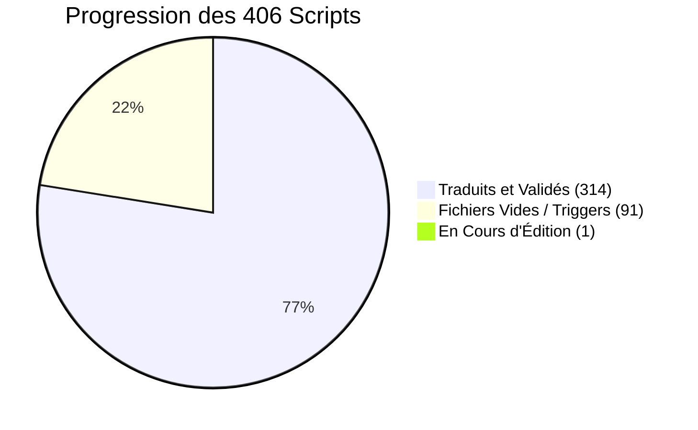
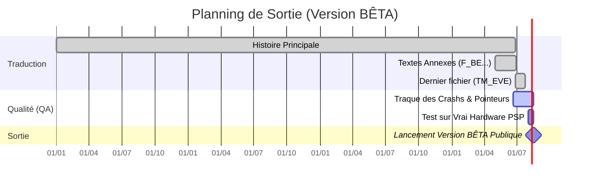

  
# Tableau de Bord & Suivi d'Avancement
  
**Persona 2: Innocent Sin FR (PSP) - ULES01557**

 

 

> [!NOTE]
> Cette page documente l'avancement global et en temps réel du projet de traduction. L'histoire principale est achevée. Nous sommes actuellement focalisés sur la phase critique d'Assurance Qualité (QA) In-Game pour chasser les derniers bugs d'affichage et de pointeurs mémoires.

  <a href="https://docs.google.com/spreadsheets/d/1d0MADmYznfH-R43RLZAHrngTT5flK9UTVt4wTzc10Uw/edit?gid=0#gid=0"><b>📊 Suivi Détaillé sur Google Sheets</b></a> | <a href="./SUIVI_TECHNIQUE.md"><b>🛠️ Problèmes Connus & Bugs (Technique)</b></a>

 

---

## Graphique d'Avancement Global

Voici la répartition des **406 fichiers scripts** identifiés qui gèrent l'intégralité des textes et des choix du jeu :

> [!TIP]
> **Les Scripts Vides (91) :** Notre scanner d'arborescence a détecté de nombreux scripts sans texte (déclencheurs d'événements invisibles ou chargements mémoires). Ils sont classés comme terminés d'office pour la traduction.

 

---

## Détails de la Traduction par Composant

Chaque composant vital du jeu possède sa propre structure de données. Voici l'état d'avancement pour chacun d'eux (pour plus de détails sur le format de ces fichiers, consultez notre `DEVELOPER.md`).

| Cible dans l'Arborescence | Rôle In-Game | Statut Actuel |
|:---|:---|:---:|
| **Scripts d'Histoire** (`event.bin`) | Contient les 399 sous-scripts de la trame narrative principale. |  |
| **Scripts de Carte** (`MMAP01` à `06`) | Dialogues ambiants des PNJ selon le quartier (Sumaru City). |  |
| **Boutique de CDs** (`CD_SHOP.BIN`) | Noms des morceaux et descriptions dans la boutique musicale. |  |
| **Combats & Menus** (`F_BE.BNP`) | Noms des démons, attaques, sorts, et interface de combat. |  |
| **Cinématiques** (`TM_EVE.BNP`) | Scènes 3D scriptées et événements visuels majeurs. |  |

> [!IMPORTANT]
> Le fichier `TM_EVE.BNP` est le dernier fichier massif nécessitant encore une intervention de traduction textuelle. Une fois celui-ci achevé, la traduction brute du jeu atteindra officiellement les 100 %.

 

---

## Phase de Relecture et Lancement

Le projet traverse actuellement sa phase la plus délicate : l'Assurance Qualité (QA) sur hardware réel ou émulateur, visant à déceler les crashs liés à la compression `CRILAYLA` et à la longueur des chaînes françaises.

