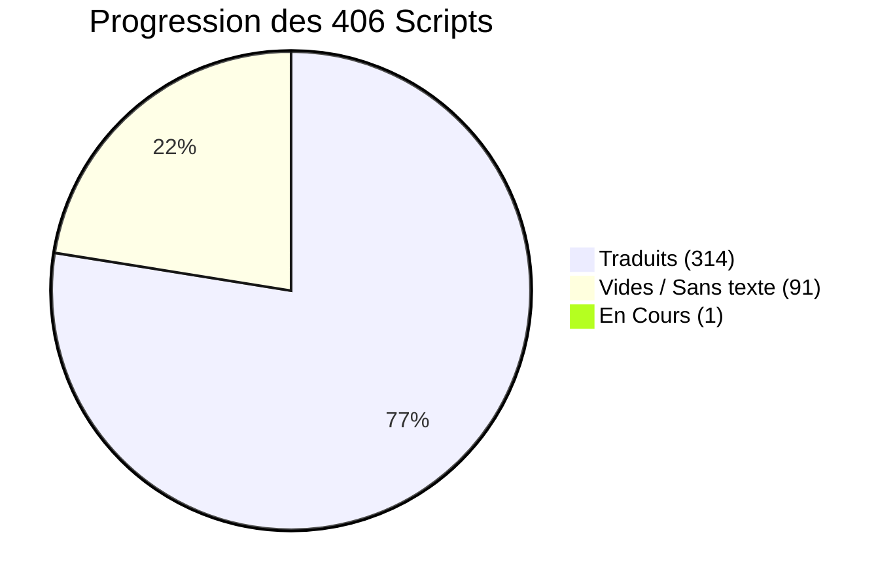
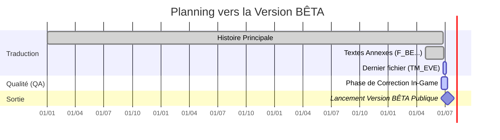

  
# Tableau de Bord & Suivi d'Avancement
  
**Persona 2: Innocent Sin FR (PSP)**

 

> [!NOTE]
> Cette page synthétise l'avancement global du projet de traduction. L'histoire principale est achevée, nous sommes dans les finitions et les tests qualité.

---

## 📊 Graphique d'Avancement Global

Voici la répartition en direct des **406 fichiers scripts** gérant l'intégralité des textes du jeu :

> [!TIP]
> **Les Scripts Vides (91) :** Ils correspondent à des événements ou des zones du jeu sans dialogue textuel (cinématiques muettes, triggers invisibles, chargements). Ils sont validés de fait.

---

## 📈 Détails de la Traduction

| Catégorie | Fichiers | Statut Actuel |
|-----------|:--------:|:-------------:|
| **Scripts d'Histoire** (`script_000` à `script_396`) | 397 | ✅ **Terminé** |
| **Scripts de Carte** (`MMAP01` à `06`) | 6 | ✅ **Terminé** |
| **Boutique de CDs** (`CD_SHOP`) | 1 | ✅ **Terminé** |
| **Combats & Menus** (`F_BE`) | 1 | ✅ **Terminé** |
| **Cinématiques narratives** (`TM_EVE`) | 1 | 🔄 **En Cours** |

> [!IMPORTANT]
> Le seul fichier nécessitant encore du travail de traduction pure est `TM_EVE`. L'histoire principale est achevée à 100%.

---

## 🗓️ Phase de Relecture et Lancement

Le projet est actuellement en pleine phase de vérification In-Game (QA).

