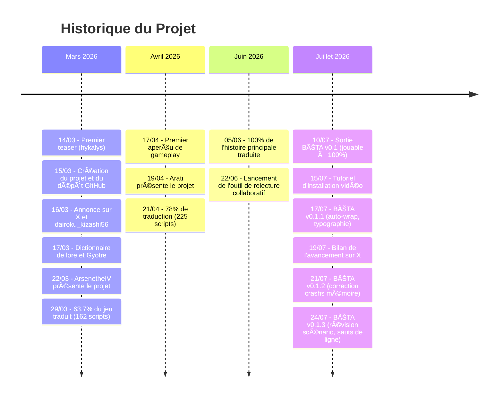

# Journal des Versions — Persona 2: Innocent Sin FR

**Suivi des releases, corrections techniques et historique du projet**

 

 

> [!NOTE]
> Ce document retrace l'historique complet des versions publiées, leurs corrections techniques, et les grandes étapes du projet. Pour le tableau d'avancement en temps réel, voir [CONTRIBUTING.md](./CONTRIBUTING.md).

 

---

## Frise Chronologique

```mermaid
timeline
    title Historique du Projet
    Mars 2026 : 14/03 - Premier teaser (hykalys)
              : 15/03 - Création du projet et du dépôt GitHub
              : 16/03 - Annonce sur X et dairoku_kizashi56
              : 17/03 - Dictionnaire de lore et Gyotre
              : 22/03 - ArsenetheIV présente le projet
              : 29/03 - 63.7% du jeu traduit (162 scripts)
    Avril 2026 : 17/04 - Premier aperçu de gameplay
               : 19/04 - Arati présente le projet
               : 21/04 - 78% de traduction (225 scripts)
    Juin 2026 : 05/06 - 100% de l'histoire principale traduite
              : 22/06 - Lancement de l'outil de relecture collaboratif
    Juillet 2026 : 10/07 - Sortie BÊTA v0.1 (jouable à 100%)
                 : 15/07 - Tutoriel d'installation vidéo
                 : 17/07 - BÊTA v0.1.1 (auto-wrap, typographie)
                 : 19/07 - Bilan de l'avancement sur X
                 : 21/07 - BÊTA v0.1.2 (correction crashs mémoire)
                 : 24/07 - BÊTA v0.1.3 (révision scénario, sauts de ligne)
```

 

---

## Historique des Versions

### BÊTA v0.1.3 — *24 Juillet 2026*

**Révision scénario et corrections d'affichage.**

- Révision complète des textes du scénario principal sur l'ensemble des 399 scripts
- Correction des sauts de ligne incorrects dans les boîtes de dialogue longues
- Préparation technique de la traduction des menus (EBOOT)

---

### BÊTA v0.1.2 — *21 Juillet 2026*

**Mise à jour critique — Stabilité, encodage et rendu.**

- **Correction du glitch mémoire** : Refonte du padding de fin de dialogue. Les espacements utilisent désormais des `[SP]` invisibles au lieu d'octets nuls (`0x0000`) qui faisaient crasher le CPU de la PSP
- **Gestion du défilement** : Repositionnement des balises de terminaison `[E1][E2]` en fin de bloc `[E3]` — 35 fichiers corrigés
- **Boîtes de choix stabilisées** : Nettoyage des balises de mise en page mal injectées dans les listes `[1208]` — 87 fichiers corrigés
- **Typographie et nameplates** : Conversion des caractères spéciaux vers ASCII et correction des retours à la ligne après les noms `[E4]` — 50 fichiers corrigés
- **Tronquage automatique** : Limitation stricte à 3 lignes par boîte pour éviter les débordements visuels

---

### BÊTA v0.1.1 — *17 Juillet 2026*

**Mise à jour mineure — Optimisation et correction de texte.**

- **Auto-wrap** : Système de retour à la ligne automatique pour que le texte s'adapte aux boîtes de dialogue sans intervention manuelle
- **Révision typographique** : Ajout des espaces insécables avant la ponctuation double (`?`, `!`, `:`, `;`), ajustement des apostrophes typographiques
- **Résolution des troncatures** : Correction des bugs visuels qui coupaient la fin de certaines répliques

---

### BÊTA v0.1 — *10 Juillet 2026*

**Première version bêta publique.**

- Jouable du début à la fin sur l'intégralité du scénario principal (`event.bin` à 100%)
- Dialogues de PNJ sur les cartes partiellement intégrés
- Textes de combat et menus (EBOOT) encore en cours d'intégration

---

### Pack HD FR v0.1 — *6 Mai 2026*

**Première sortie du pack de textures françaises.**

- Traduction des menus et éléments de l'interface en haute définition
- À superposer sur le pack HD original de racawr dans PPSSPP

 

---

## État d'Avancement Global

| Fichier / Composant | Contenu | Progression |
|:---|:---|:---:|
| `event.bin` | 399 scripts d'histoire | **100%** |
| `MMAP01` à `MMAP06` | Dialogues PNJ sur les cartes | **100%** |
| `CD_SHOP.BNP` | Boutique de CD | **100%** |
| `F_BE.BNP` | Répliques de combat | **100%** |
| `TM_EVE.BNP` | Cinématiques in-game scriptées | **100%** |
| `EBOOT.BIN` | Menus, noms, descriptions (6574 entrées) | **~15%** |
| Textures HD | Interface graphique haute définition | **35/42** |
| Textures ISO | Éléments graphiques embarqués dans l'ISO | **0/42** |

> [!IMPORTANT]
> L'EBOOT.BIN est le dernier grand chantier restant. Sa traduction complète marquera la couverture textuelle à 100% du jeu.

